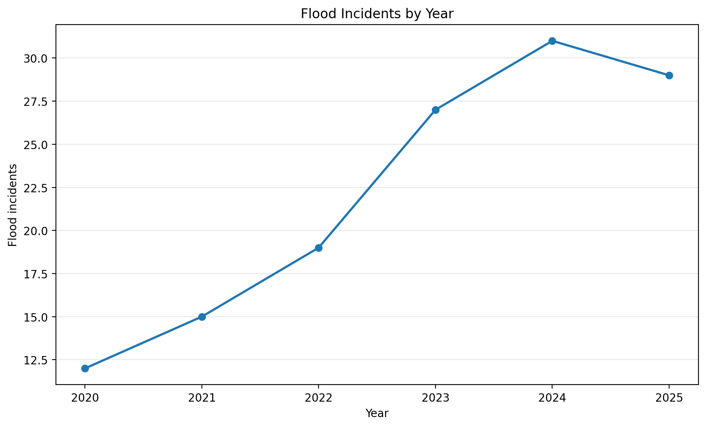
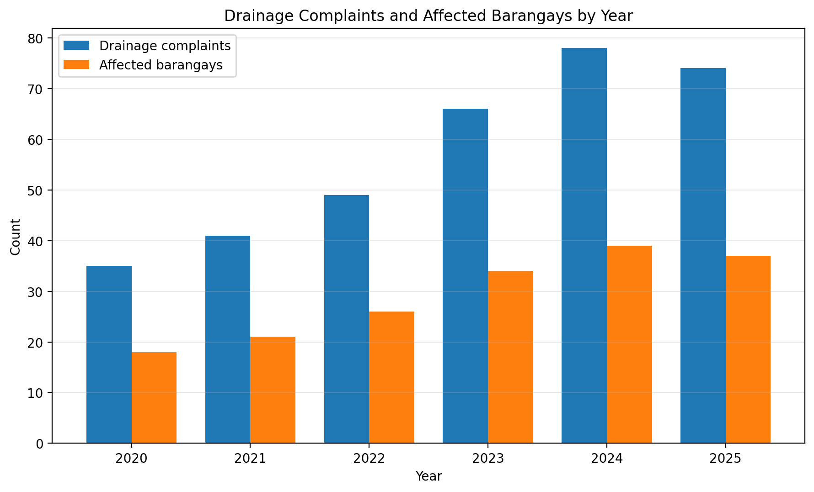

# Automated Visual Data Report: Davao City Flood Incidents and Drainage Response Trends

## Dataset Focus

This automated visual data report focuses on **Davao City flood incidents and drainage response trends from 2020 to 2025**. The dataset is a mock CSV dataset created for academic purposes to simulate how a regional development office or LGU department might analyze flood-related data.

The report focuses on four key indicators:

1. Flood incidents
2. Affected barangays
3. Drainage complaints
4. Evacuation responses

The purpose of this report is to show how AI can support data cleaning, visual analysis, and policy interpretation for regional development concerns in Mindanao.

---

## 1. Raw Dataset

The raw dataset is also uploaded as a CSV file in this folder: [davao-flood-response-dataset.csv](davao-flood-response-dataset.csv)

```csv
Year,Flood Incidents,Affected Barangays,Drainage Complaints,Evacuation Responses,Notes
2020,12,18,35,8,Moderate rainfall and localized street flooding
2021,15,21,41,11,Heavy rainfall affected low-lying barangays
2022,19,26,49,14,River swelling and drainage overflow reported
2023,27,34,66,20,Strong rainfall and increased drainage complaints
2024,31,39,78,24,Multiple barangays reported recurring flood issues
2025,29,37,74,22,Flood risk remained high but slightly lower than 2024
```

---

## 2. AI Data Analysis Prompt

```text
Act as a Data Analyst attached to a regional development council in Mindanao.

Analyze this mock CSV dataset about Davao City flood incidents and drainage response trends from 2020 to 2025.

Dataset:
Year,Flood Incidents,Affected Barangays,Drainage Complaints,Evacuation Responses,Notes
2020,12,18,35,8,Moderate rainfall and localized street flooding
2021,15,21,41,11,Heavy rainfall affected low-lying barangays
2022,19,26,49,14,River swelling and drainage overflow reported
2023,27,34,66,20,Strong rainfall and increased drainage complaints
2024,31,39,78,24,Multiple barangays reported recurring flood issues
2025,29,37,74,22,Flood risk remained high but slightly lower than 2024

Your tasks:
1. Identify possible data cleaning steps needed.
2. Provide a cleaned dataset preview.
3. Recommend two high-contrast charts for a GitHub visual report.
4. Write a short human analytical narrative linking the trend to flood preparedness, drainage planning, and barangay-level disaster response in Davao City.

Use a formal but understandable tone.
```

---

## 3. Data Cleaning Protocol Log

### Raw Input Problem

The mock CSV dataset was mostly readable, but it still needed structural cleaning before analysis. The column names contained spaces, the numeric fields needed to be confirmed as count values, and the qualitative notes column had to be separated from the numerical analysis.

### AI Cleaning Instruction

The AI was instructed to review the dataset, identify possible cleaning steps, provide a cleaned dataset preview, recommend visualizations, and write an analytical narrative connected to flood preparedness and drainage response in Davao City.

### Cleaning Steps Identified

1. **Standardize column names.**  
   The column names should be consistent and analysis-friendly. For example, `Flood Incidents` can be treated as `Flood_Incidents`, `Affected Barangays` as `Affected_Barangays`, `Drainage Complaints` as `Drainage_Complaints`, and `Evacuation Responses` as `Evacuation_Responses`.

2. **Check for missing values.**  
   Each row should be reviewed to confirm that all year, flood incident, affected barangay, drainage complaint, and evacuation response values are complete.

3. **Confirm numeric formatting.**  
   The columns for flood incidents, affected barangays, drainage complaints, and evacuation responses should be treated as numeric count variables.

4. **Arrange data chronologically.**  
   The dataset should be sorted from 2020 to 2025 so the trend can be interpreted clearly.

5. **Separate qualitative notes from numerical charting.**  
   The `Notes` column provides useful background, but it should not be used as a numeric variable in the charts.

6. **Check for possible outlier years.**  
   The years 2023 and 2024 show stronger increases in flood incidents and drainage complaints, so they should be highlighted in the interpretation.

### Cleaning Result

The dataset was successfully organized into a clean six-year trend table. All numeric values were complete, and no missing values were found. The `Notes` column was retained as qualitative context but excluded from chart generation.

---

## 4. Cleaned Dataset Preview

| Year | Flood Incidents | Affected Barangays | Drainage Complaints | Evacuation Responses |
|---|---:|---:|---:|---:|
| 2020 | 12 | 18 | 35 | 8 |
| 2021 | 15 | 21 | 41 | 11 |
| 2022 | 19 | 26 | 49 | 14 |
| 2023 | 27 | 34 | 66 | 20 |
| 2024 | 31 | 39 | 78 | 24 |
| 2025 | 29 | 37 | 74 | 22 |

---

## 5. Visualizations Generated

### Chart 1: Flood Incidents by Year



**Chart Caption:**  
The chart shows that flood incidents increased from 12 in 2020 to 31 in 2024, before slightly decreasing to 29 in 2025. This suggests that flood incidents became more frequent during the middle and later part of the period, even though there was a small improvement after 2024.

---

### Chart 2: Drainage Complaints and Affected Barangays by Year



**Chart Caption:**  
The chart compares drainage complaints and affected barangays from 2020 to 2025. Both indicators increased strongly from 2020 to 2024, suggesting that drainage problems may be related to the rising number of barangays affected by flooding. The slight decline in 2025 still remains higher than the early years of the dataset.

---

## 6. Human Analytical Narrative

The data chart clearly shows that Davao City experienced an upward trend in flood-related concerns from 2020 to 2024. Flood incidents increased from 12 cases in 2020 to 31 cases in 2024. During the same period, drainage complaints increased from 35 to 78, while affected barangays increased from 18 to 39.

This trend suggests that flood risk in Davao City is not only caused by sudden heavy rainfall. It is also connected to urban drainage conditions, clogged waterways, low-lying barangays, and the ability of local systems to manage rainwater during strong weather events.

The 2025 data shows a slight decrease in flood incidents, affected barangays, drainage complaints, and evacuation responses compared to 2024. However, the values remain much higher than the 2020 and 2021 levels. This means that the issue remains a continuing concern and should not be treated as fully resolved.

For regional policymakers and LGU department heads, the data suggests that flood preparedness should include both emergency response and preventive planning. Emergency response includes evacuation coordination, public advisories, and barangay-level monitoring. Preventive planning includes drainage clearing, storm drain improvement, flood-control infrastructure, and regular maintenance of canals and waterways.

The increase in evacuation responses also shows the importance of barangay-level disaster coordination. As more barangays are affected, local officials, disaster response teams, and community volunteers need to be prepared to guide residents, assist vulnerable groups, and provide clear instructions before, during, and after flooding.

---

## 7. Policy Insight for LGU Planning

Based on the visualized trend, Davao City flood planning should prioritize both infrastructure and community preparedness.

LGU departments may consider the following policy directions:

1. Conduct regular drainage inspection and cleaning before the rainy season.
2. Identify barangays with repeated flood incidents and drainage complaints.
3. Improve storm drains and canal systems in low-lying and densely populated communities.
4. Strengthen barangay-level early warning and evacuation coordination.
5. Prepare targeted public advisories for residents near rivers, canals, and flood-prone roads.
6. Coordinate solid waste management with drainage maintenance to reduce blockage.
7. Use yearly flood and drainage data to guide budget allocation for flood-control projects.

These actions can help local officials move from reactive disaster response to preventive flood-risk management.

---

## 8. Final Reflection

This project shows how AI can support research and data analysis by helping clean a dataset, identify key variables, recommend charts, and organize the findings into a visual report. The AI analysis made it easier to understand the relationship between flood incidents, affected barangays, drainage complaints, and evacuation responses.

However, the human analytical narrative remains important. AI can describe patterns, but people must connect the numbers to real local conditions, such as urban drainage problems, barangay preparedness, flood-prone communities, and LGU planning needs.

The final report demonstrates that data visualization is not only about showing charts. It is also about explaining what the numbers mean and how they can support better decisions for communities in Mindanao.

---

## Files Included

```text
AI for Research & Data Analysis (Visual Reports)
├── davao-flood-data-visual-report.md
├── davao-flood-response-dataset.csv
├── chart-1-flood-incidents.png
└── chart-2-drainage-response.png
```

### Dataset File

The mock CSV dataset used for this report is included here:

[davao-flood-response-dataset.csv](davao-flood-response-dataset.csv)
